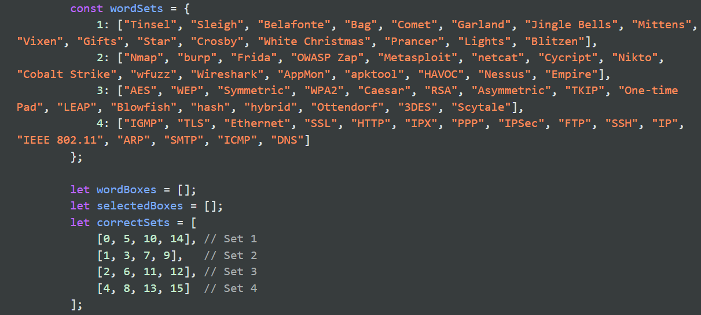

## SANS Holiday Hack Challenge 2024

SANS Holiday Hack Challenge 2024 Prologue consists of **2 challenges** which can be solved in an easy (silver medal) or hard way (gold medal). Through this write-up, we will cover both solutions for the two challenges.

### Elf Connect (Challenge 1)

#### Easy
For the easy challenge, we should play the game and solve all the levels (4). The game consists of connecting 4 words that have similar "meaning/realtionship".

_This is an easy level image_


If you browse tghe code through the developer tools, you can get the solutions for the game:


But since it was the first challenge, I just passed it by playing it normally and connecting the words.

#### Hard
For the hard challenge, you need to take a deep look at the code and try to find a way to *alter* the initial score so you can achieve more than 50,000 points.

I just searched for `score` and found:
```javascript
let score = parseInt(sessionStorage.getItem('score') ||'0'); // Initialize score
```

But I also found:
```javascript
let urlParams = new URLSearchParams(window.location.search);
const roundCheck = urlParams.get('round');
if (!roundCheck) {  // If 'round' is absent or has no value
  sessionStorage.clear();
}
```

So, if we combine both pieces of information, we can work on how to hack the game.

1. First, we start the game and configure the game Session storage values.
2. We  add `score=50001` (this will be our initial score, instead of `0`).
3. We close the game and use [Burp Suite](https://portswigger.net/burp) to intercept the request when loading again the game.
4. We add `round` as a query parameter, so the game will not clear (refresh) our session storage values configured previously.

For the first two steps, we will open the `Application` tab from the development tools. Then, we will add our custom `score` value:


Then, we close the game. We will intercept the request when opening again the game, add `score` as a query parameter and forward the request:


This will reload the game, but we will keep the values we have entered before in the game Storage session:


So, when we stop intercepting and it finishes the load, we will see our initial score is 50001:


### Elf Minder 9000 (Challenge 1)

#### Easy
For the easy challenge, we need to pass all the levels in the game (just pass them; there’s no need for a perfect score or to pass them in boss mode). The game requires reaching from the start point to the end point and collecting all the boxes along the way, all within a limited time.


I won't put all the solutions, but it should take no more than 30-45 minutes. There are 12 levels (the last one is not needed):


### Hard
For the hard challenge, we need to pass the final level `A Real Pickle`. To pass it, we must hack the game somehow, as it's not possible to pass it with our current tools.

Searching through the code, I found the adminsitrator tools:
```html
<div class="admin-controls hidden">
    <!-- <button id="startBtn">Start</button> -->
    <button id="resetBtn">Reset</button>
    <button id="clearPathBtn">Clear Path</button>
    <button id="clearEntitiesBtn">Clear Entities</button>
    <fieldset id="tools">...</fieldset>
</div>
```

If we remove the `hidden` attribute, we will be able to see the tools in our level:


If we click on `Clear Entities`, we will remove all the entities, and we can draw our path (passing through the rocks):


So now, we can return home, load again the level and pass it... But we receive an error message:


It looks like the game doesn't like that we walk through the rocks... Let's try to avoid them, maybe we can add a tunnel at the end flag? (Remeber adding a path line in the last tunnel, so the elf can "walk" to the end flag)


And yes, with this we solve the challenge!
